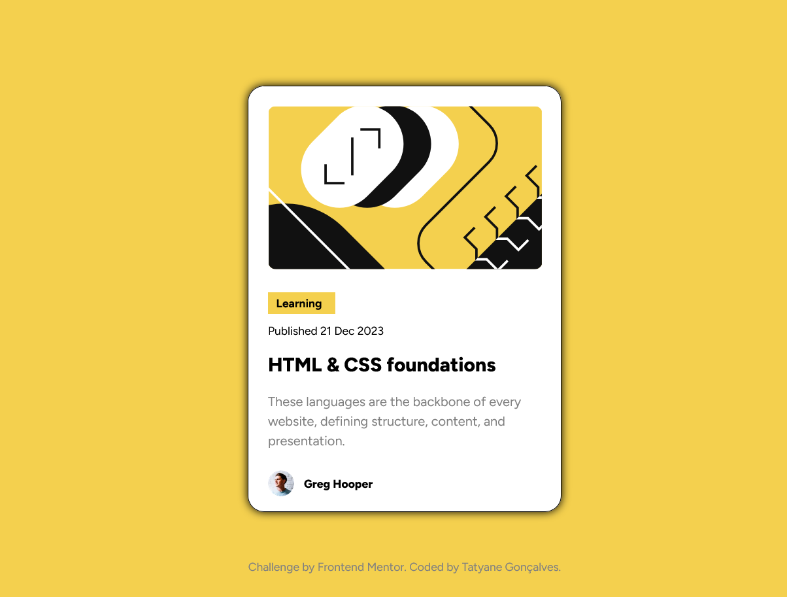

<h1 align="center">Cartão de Visualização de Blog</h1>


Essa é a solução do desafio [Blog preview card](https://www.frontendmentor.io/challenges/blog-preview-card-ckPaj01IcS) do [Frontend Mentor](https://www.frontendmentor.io/home). Os desafios ajudam a melhorar as habilidades de codificação através da construção de projetos realistas.

## Índice

- [Visão geral](#visão-geral)
   - [O desafio](#o-desafio)
   - [Links](#links)
- [Meu processo](#meu-processo)
   - [Construído com](#construído-com)
   - [O que aprendi](#o-que-aprendi)
   - [Recursos úteis](#recursos-úteis)
- [Contato](#contato)
  - [Avaliação](#avaliação)

## Visão Geral

### O desafio

O desafio é construir este cartão de visualização do blog e fazer com que pareça o mais próximo possível do design.

Os usuários devem ser capazes de:

Veja os estados de foco e foco de todos os elementos interativos na página

### Links 

- Solução URL: [Resposta](https://github.com/tatyanepgoncalves/Cartao-de-blog)
- Live Site URL: [Site Ativo](https://tatyanepgoncalves.github.io/Cartao-de-blog/)

## Meu processo

### Construído com 

- HTML5 
- Propriedades personalizadas CSS
- Caixa flexível
- Fluxo de trabalho voltado para dispositivos móveis

### O que aprendi

Posicionar um elementon com position
```css
.attribution {
  position: fixed;
  bottom: 0;
  left: 0;
  font-size: 14px;
  color: #808080;
  width: 100%;
  text-align: center;
  padding: 30px;
}
```


### Recursos Úteis

- [W3schools](https://www.w3schools.com/) - Site que usar para buscar dicas de tags e instruções para que consiga o resultado esperado. 
- [MDN Web Docs](https://developer.mozilla.org/pt-BR/) - Site da Mozzila que possui documentação de tecnologias de plataforma Web e que fornece um amplo conjunto de recursos de aprendizagem para desenvolvedores iniciantes. 

## Contato


- Frontend Mentor - [@tatyanepgoncalves](https://www.frontendmentor.io/profile/tatyanepgoncalves)
- GitHub - [@tatyanepgoncalves](https://github.com/tatyanepgoncalves)
- LinkedIn - [@tatyanepgoncalves](https://www.linkedin.com/in/tatyanegoncalves/)

### Avaliação
De uma ⭐ se gostou desse projeto. 